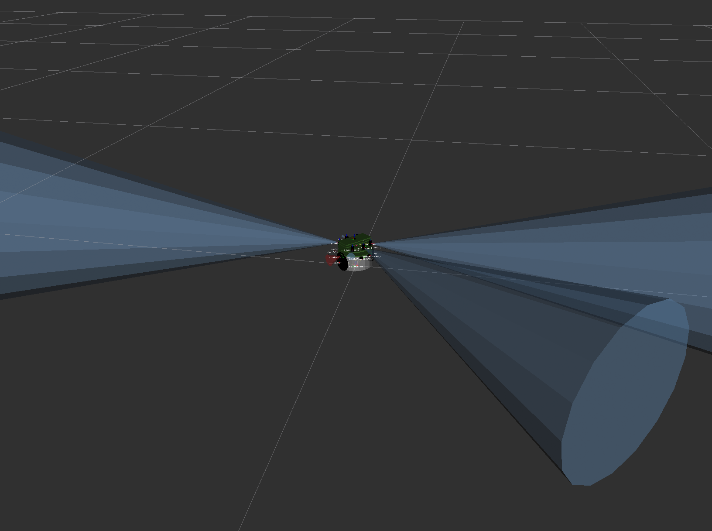

# Pi-puck ROS Driver Package

## Introduction

This repository contains the ROS driver package for support for the Pi-puck robotics platform.

### Pi-puck

The Pi-puck is a [Raspberry Pi](https://www.raspberrypi.org) extension board for the [e-puck](http://www.gctronic.com/doc/index.php?title=E-Puck) and [e-puck2](http://www.gctronic.com/doc/index.php?title=e-puck2) robot platforms, designed and built as a collaboration between the [University of York](https://www.york.ac.uk/robot-lab/) and [GCtronic](http://www.gctronic.com).

For more information about the Pi-puck, see:
- GCtronic wiki page - http://www.gctronic.com/doc/index.php?title=Pi-puck
- Pi-puck on the YRL website - https://www.york.ac.uk/robot-lab/pi-puck/
- IROS 2017 paper - https://eprints.whiterose.ac.uk/120310/

## Supported Features

This package has only been tested with ROS Melodic.

The following features are currently supported:

- [x] Navigation
  - [x] Spatial
    - [x] IMU (Z-rotation mode and full 3-axis mode)
    - [ ] Accelerometer (Not exposed by Pi-puck e-puck firmware, changes to firmware needed if we want to expose this)
    - [x] Transform server
      - [x] Static transforms
      - [ ] Dynamic transform
        - [x] Rotation
        - [ ] Translation
  - [x] Motors
    - [x] Speed
    - [x] Steps 
    - [ ] Odometry
  - [x] Proximity
    - [x] e-puck IR (< 1 metre range)
    - [x] Pi-puck IR (between 1.35 and 4 metre range based on mode)
- [ ] Vision
  - [ ] e-puck camera
  - [ ] Pi-puck camera 
- [ ] Sound
  - [ ] Speaker
  - [ ] Microphones
- [ ] Power
  - [ ] Battery ADC
- [ ] Display
  - [ ] OLED
- [ ] I/O
  - [ ] ADC
  - [ ] Navigation switch

## Nodes

### Motor

The motor node provides topics for the left and right motors which allow setting the speed and reading the current step count.

### Short Range IR (Reflected)

The short range IR (Infrared) node provides topics for range reading from the 8 short range (4mm < r < 50mm) IR sensors located radially on the e-puck.

The indices of the short range IR sensors are show in the diagram below:

### Long Range IR (Time-of-Flight)

The long range IR node provides a topic for the range reading from one of the 6  long range (up 4m depending on mode) IR laser time-of-flight sensors located around the pi-puck. There should be one instance of this node per sensor using the `~sensor` parameter of the node to set the sensor index, see [configuration](#configuration).

The indices of the long range IR sensors are show in the diagram below:

## Driver Tree

**NB:** These paths are based on the suggested tree as defined by `full.launch`.

- /pi-puck/navigation/motors/
  - topics:
    - provides:
      - steps_right
      - steps_left
    - subscribes:
      - speed_right
      - speed_left
  - parameters:
    - ~rate = 10
- /pi-puck/navigation/proximity/short_range_ir/
  - topics:
    - provides:
      - 0-7 inclusive
  - parameters
    - ~rate = 5
- /pi-puck/navigation/proximity/long_range_ir/
  - topics:
    - provides:
      - 0-5 inclusive
  - parameters:
    - ~rate = 1
    - ~sensor = 0 (see [configuration](#configuration))
    - ~mode = "short"

## Configuration

### Motors

| Parameter | Default Value | Valid Values   | Description                                  |
| --------- | ------------- | -------------- | -------------------------------------------- |
| ~rate     | 10 hertz      | positive float | The rate at which the node updates in hertz. |

### Short Range IR

| Parameter | Default Value | Valid Values   | Description                                  |
| --------- | ------------- | -------------- | -------------------------------------------- |
| ~rate     | 5 hertz       | positive float | The rate at which the node updates in hertz. |

### Long Range IR

| Parameter | Default Value | Valid Values              | Description                                                  |
| --------- | ------------- | ------------------------- | ------------------------------------------------------------ |
| ~rate     | 1 hertz       | positive float            | The rate at which the node updates in hertz.                 |
| ~mode     | "short"       | "short", "medium", "long" | Sets the mode for the sensor. Short range mode is more accurate in all light conditions, up to 1.35 metres. However, long and medium modes are more accurate beyond 1.35 metres, but are more susceptible to light conditions. |
| ~sensor   | 0             | An integer 0-5 inclusive  | The index of the sensor this node monitors. Typically six instances of the long range IR node are run, one for each sensor. Separate nodes (or a worse hack) are required due to limitations in the ST Microelectronics driver and how it interacts with Python. |

## Example Usage

TODO

## Robot Model (URDF)

A model of the Pi-puck can be found in `src/pi_puck_driver/src/urdf/pi_puck_urdf.xml`. 

## RVIZ

RVIZ configuration displaying data from all sensors of the Pi-puck can be found in `src/pi_puck_driver/src/rviz/pi_puck.rviz`.
